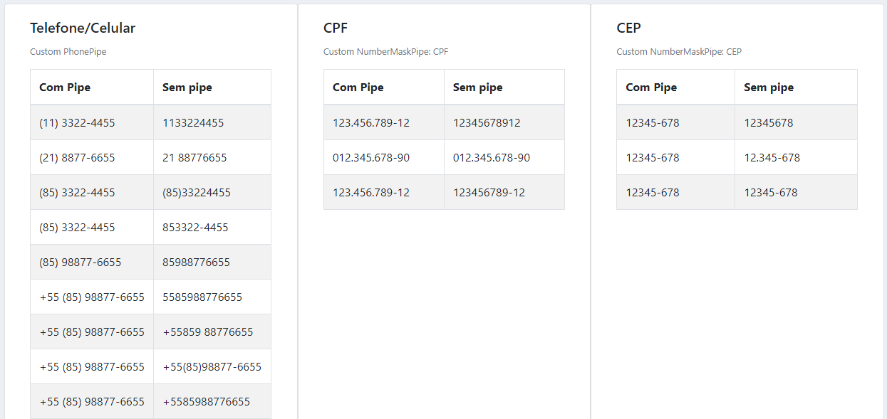

# MaskApp

Projeto para experimentação e demostração de pipes, diretivas e funções auxiliares para exibição (interpolação) e máscara em campos input (números telefônicos no padrão do Brasil, cep e cpf).

Projeto gerado com [Angular CLI](https://github.com/angular/angular-cli) versão 9.0.3.

 > Desenvolvedora: [Kamila Serpa](https://kamilaserpa.github.io)

## Pipes
Imagem dos pipes em funcionamento no projeto.
Demonstração em https://maskappangular.web.app/.

## Considerações
Considerações sobre os campos de input. Os assinalados com (*) apresentaram melhor comportamento para input de numeros telefônicos.

### [PhonePipe](src/app/shared/phone-pipe)

#### Telefone 1
Utiliza [PhonePipe](src/app/shared/phone-pipe/phone.pipe.ts)
 - Implementa máscaras (xx) #xxxx-xxxx, (xx) #xxxx - xxxx, +xx (xx) #xxxx - xxxx, de acordo com o número de caracteres digitados
 - O número de caracteres pode ser limitado pelo atributo maxlength no html
 - But: Aceita caracteres não numéricos.

#### Telefone 2
Utiliza [PhonePipe](src/app/shared/phone-pipe/phone.pipe.ts) limitando a digitação para no máximo 11 caracteres
 - Implementa máscaras (xx) #xxxx - xxxx.
 - But: Aceita caracteres não numéricos.

#### Telefone 3
Utiliza [PhonePipe](src/app/shared/phone-pipe/phone.pipe.ts) e function [onlyNumbers()](https://gitlab.com/angular-kamila/mask-app/-/blob/master/src/app/form/form.component.ts#L74)
 - Implementa máscaras (xx) #xxxx-xxxx, (xx) #xxxx - xxxx, +xx (xx) #xxxx - xxxx, de acordo com o número de caracteres digitados
 - O número de caracteres pode ser limitado pelo atributo maxlength no html
 - Bloqueia digitação de caracteres não numéricos
 - But: aceita caracteres não numéricos ao colar e arrastar valor (Ctrl + V)

#### Telefone 4 (*)
Utiliza [PhonePipe](src/app/shared/phone-pipe/phone.pipe.ts) e diretiva [OnlyNumbersDirective](src/app/shared/only-numbers/only-numbers.directive.ts)
 - Implementa máscaras (xx) #xxxx-xxxx, (xx) #xxxx - xxxx, +xx (xx) #xxxx - xxxx, de acordo com o número de caracteres digitados
 - O número de caracteres pode ser limitado pelo atributo maxlength no html
 - Bloqueia digitação de caracteres não numéricos
 - Remove caracteres não numéricos ao colar valor (Ctrl + V)
 - But: não implementa máscara ao colar valor (Ctrl + V) idêntico aos dígitos numéricos já presentes no campo

### [PhoneMask()](https://gitlab.com/angular-kamila/mask-app/-/blob/master/src/app/form/form.component.ts#L83)

#### Telefone 5 (*)
Utiliza a function [phoneMask($event)](https://gitlab.com/angular-kamila/mask-app/-/blob/master/src/app/form/form.component.ts#L83) no evento _keyup_ e diretiva OnlyNumbers.
- Implementa máscara (xx) xxxxx-xxxx
- Implementa máscara ao colar valor (Ctrl + V)
- Remove caracteres não numéricos ao colar valor (Ctrl + V) (reflete na variável associada pelo ngModel)
- Bloqueia digitação de caracteres não numéricos

#### Telefone 6
Utiliza a function [phoneMask($event)](https://gitlab.com/angular-kamila/mask-app/-/blob/master/src/app/form/form.component.ts#L83) no evento _keyup_. O listenner do event _keyup_ foi adicionado pois assim é possível inserir a máscara ao colar valor (Ctrl + V), o que não é possível com _keypress_.
- Implementa máscara (xx) #xxxx-xxxx
- Implementa máscara ao colar valor (Ctrl + V)
- Não exibe caracteres não numéricos ao colar valor (Ctrl + V)
- Bloqueia digitação de caracteres não numéricos (o caractere aparece rapidamente no campo de input antes de ser removido). O caractere não numérico, se foi o último a ser digitado, é inserido na variável associada pelo ngModel, após a digitação de um número o caractere não numérico é retirado.
- But: atribui à variável javascript, associada pelo ngModel, caracteres não numéricos ao copiar valor, embora não sejam exibidos ao usuário.

#### Telefone 7
Utiliza a function [phoneMask($event)](https://gitlab.com/angular-kamila/mask-app/-/blob/master/src/app/form/form.component.ts#L83) no evento _keyup_ e function [onlyNumbers()](https://gitlab.com/angular-kamila/mask-app/-/blob/master/src/app/form/form.component.ts#L74) no evento _keypress_.
 - Implementa máscara (xx) #xxxx-xxxx
 - Implementa máscara ao colar valor (Ctrl + V)
 - Não exibe caracteres não numéricos ao colar valor (Ctrl + V)
 - Bloqueia digitação de caracteres não numéricos.
 - But: atribui à variável javascript, associada pelo ngModel, caracteres não numéricos ao copiar valor, embora não sejam exibidos ao usuário.

#### Telefone 8 (*)
Utiliza a function [phoneMask($event)](https://gitlab.com/angular-kamila/mask-app/-/blob/master/src/app/form/form.component.ts#L83) no evento _keyup_ e diretiva [OnlyNumbersDirective](src/app/shared/only-numbers/only-numbers.directive.ts)
- Implementa máscara (xx) #xxxx-xxxx 
- Implementa máscara ao colar valor (Ctrl + V)
- Remove caracteres não numéricos ao colar valor (Ctrl + V) (reflete na variável associada pelo ngModel)
- Bloqueia digitação de caracteres não numéricos

### [NumberMaskPipe](src/app/shared/number-mask-pipe)
Pipe para números telefônicos com código de área e nono dígito opcional, cep e cpf.
Aplicação:

`{{ number | numberMask: 'phone'}}` 
`{{ number | numberMask: 'cep'}}`  
`{{ number | numberMask: 'cpf'}}`

#### Telefone 9 (*)
Utiliza o [NumberMaskPipe](src/app/shared/number-mask-pipe) e diretiva [OnlyNumbersDirective](src/app/shared/only-numbers/only-numbers.directive.ts)
- Implementa máscara +xx (xx) #xxxx-xxxx 
- Implementa máscara ao colar valor (Ctrl + V)
- Remove caracteres não numéricos ao colar valor (Ctrl + V) (reflete na variável associada pelo ngModel)
- Bloqueia digitação de caracteres não numéricos

## Links

 - _Keypress_: "O evento _keypress_ é disparado quando uma tecla que produz um valor do tipo caractere".
 https://developer.mozilla.org/pt-BR/docs/Web/API/Document/_keypress__event
 - _Keyup_: "O evento _keyup_ é acionado quando uma tecla é liberada".
 https://developer.mozilla.org/pt-BR/docs/Web/API/Document/_keyup__event
 - Expressões Regulares https://developer.mozilla.org/pt-BR/docs/Web/JavaScript/Guide/Regular_Expressions
 - Pipes https://angular.io/guide/pipes

## Firebase

`npm install -g firebase-tools`  
``firebase login`  
`firebase init` 
`firebase deploy`

### Angular

#### Development server
Run `npm install` to install dependencies.
Run `ng serve` for a dev server. Navigate to `http://localhost:4200/`. The app will automatically reload if you change any of the source files.

#### Code scaffolding
Run `ng generate component component-name` to generate a new component. You can also use `ng generate directive|pipe|service|class|guard|interface|enum|module`.
